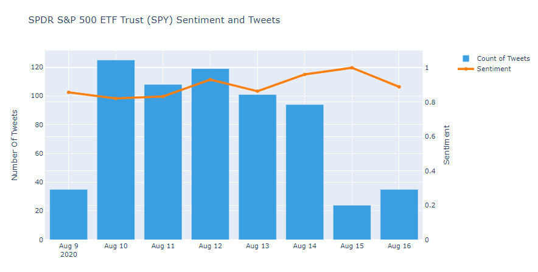

### Data Science Projects

### [Project 1: Twitter Sentiment Analysis on Tweets featuring #stocks](https://github.com/AdamShafi92/Twitter-Sentiment-Analysis)
* Retrieved data using the Twitter API and labelled tweets 1000 manually.
* Cleaned the data to remove special characters and unnessary words
* Performed lemmatisation to group together inflected words
* Transformed the data into the correct format for NLTK (Natural Language Toolkit)
* Optimised mutliple skLearn models including Logistic Regression, Random Forest Classification to reach the best model
* This could be used as one indicator in a larger dataset aimed at predicting stock prices, or looking at the influence of Twitter on stock prices

